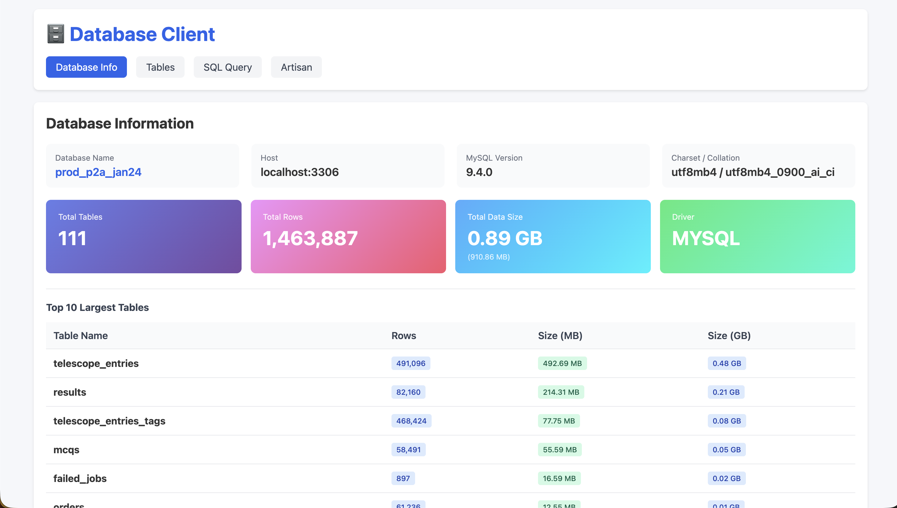
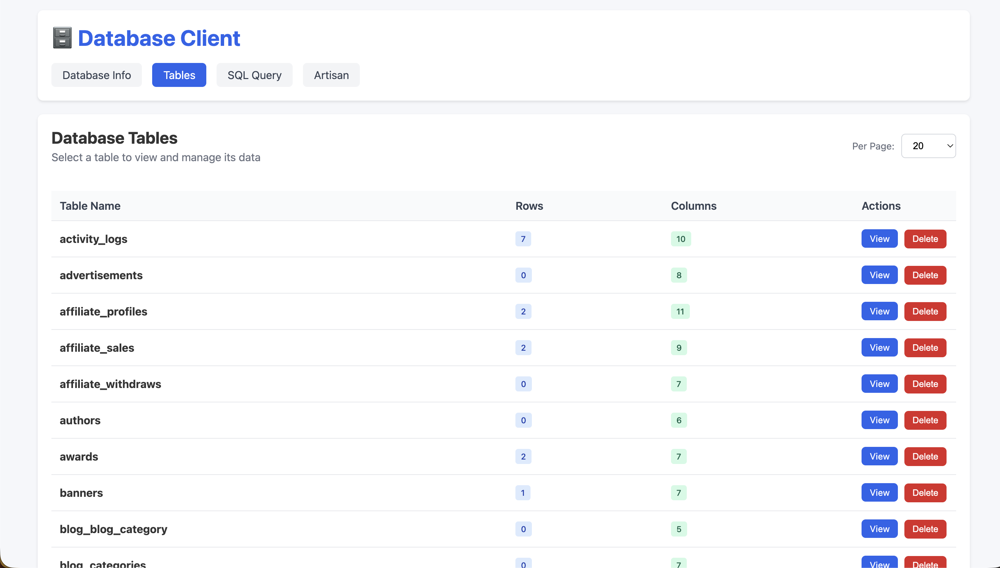
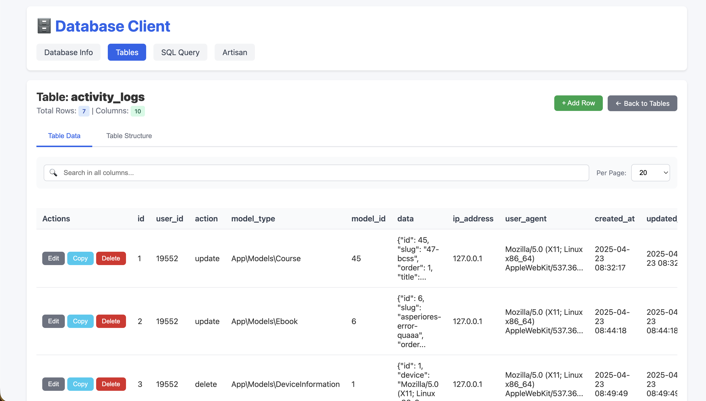
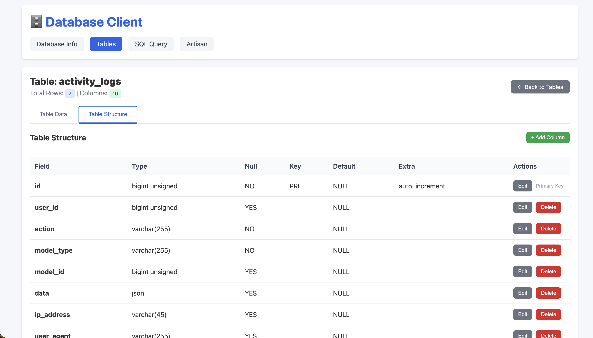
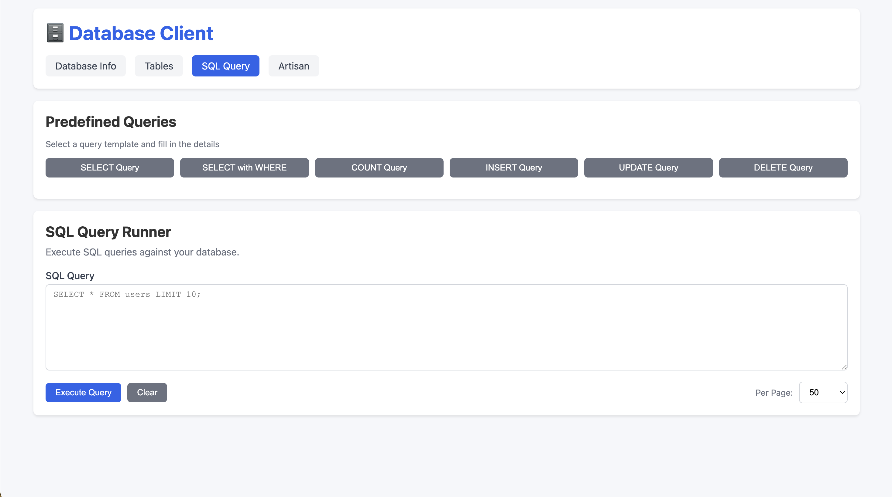
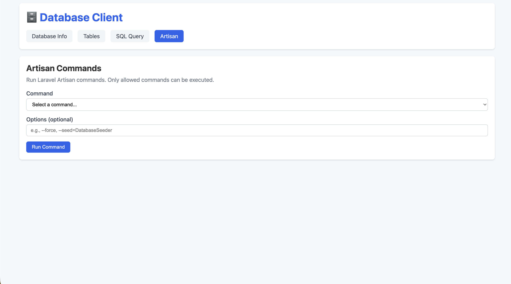

# Laravel DB Client

A lightweight database client package for Laravel that provides a Blade UI to access your connected database, view tables, manage data, and run SQL queries.

**Repository:** [rafidalridwan/laravel-db-client](https://github.com/rafidalridwan/laravel-db-client)

## Features

- 📊 **View All Tables** - Browse all database tables with row counts and column information
- 🔍 **Table Data View** - View table data with pagination
- ✏️ **Add/Edit/Delete Rows** - Full CRUD operations on table data
- 🔐 **SQL Query Runner** - Execute SQL queries with security checks
- 🛠️ **Artisan Commands** - Run Laravel Artisan commands through the UI
- 🔒 **Security** - Built-in SQL injection protection and read-only mode support
- 📱 **Responsive UI** - Modern, clean interface

## Installation

1. Install the package via Composer:

```bash
composer require rafidalridwan/laravel-db-client
```

The package is auto-discovered by Laravel.

2. Publish assets:

```bash
php artisan vendor:publish --tag=dbclient
```

<!-- ## Configuration

Edit `config/dbclient.php` to configure:

```php
return [
    'middleware' => ['web', 'auth'],  // Middleware to protect routes
    'read_only' => false,              // Enable read-only mode

    'allowed_commands' => [            // Artisan commands allowed
        'migrate',
        'migrate:status',
        'migrate:rollback',
        'db:seed',
    ],
];
``` -->

## Usage

1. Navigate to `/dbclient` in your browser (make sure you're authenticated if using auth middleware)

2. **Tables View** - Lists all tables with row counts

   - Click "View" to see table data
   - View table structure in collapsible section
   - Add, edit, or delete rows

3. **SQL Query** - Run custom SQL queries

   - Type your query and click "Execute"
   - Results are displayed in a table
   - Execution time is shown
   - Dangerous operations are blocked in read-only mode

4. **Artisan** - Run Laravel Artisan commands
   - Select from allowed commands
   - View command output

## Security Features

- **SQL Guard** - Blocks dangerous SQL operations (DROP, TRUNCATE, ALTER, CREATE, etc.)
- **Read-Only Mode** - When enabled, only SELECT queries are allowed
- **Table Name Sanitization** - Prevents SQL injection through table names
- **Middleware Protection** - Routes are protected by configurable middleware

## Routes

- `GET /dbclient` - Tables list
- `GET /dbclient/table/{table}` - View table data
- `GET /dbclient/table/{table}/rows` - Get paginated rows (JSON)
- `GET /dbclient/table/{table}/row/{id}` - Get single row (JSON)
- `POST /dbclient/table/{table}/insert` - Insert new row
- `PUT /dbclient/table/{table}/{id}/update` - Update row
- `DELETE /dbclient/table/{table}/{id}/delete` - Delete row
- `GET /dbclient/query` - SQL query interface
- `POST /dbclient/query/run` - Execute SQL query
- `GET /dbclient/artisan` - Artisan commands interface
- `POST /dbclient/artisan/run` - Run Artisan command

## 📸 Screenshots
<!-- 
### 🗃️ Database Overview
 -->

### 📊 Tables Overview


### 🔍 Table Data View


### 🏗️ Table Structure


### 💻 SQL Query Runner


### 🛠 Artisan Commands



## Requirements

- PHP >= 8.1
- Laravel >= 8.0
- jQuery (included via CDN in views)

## License

MIT
